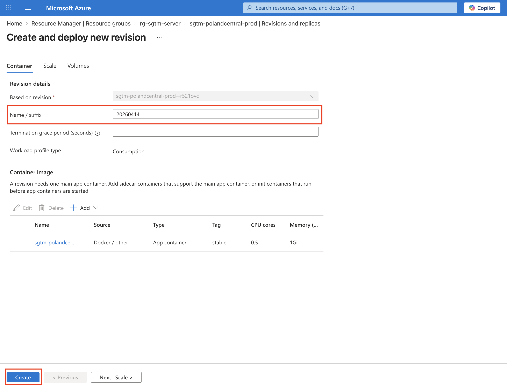
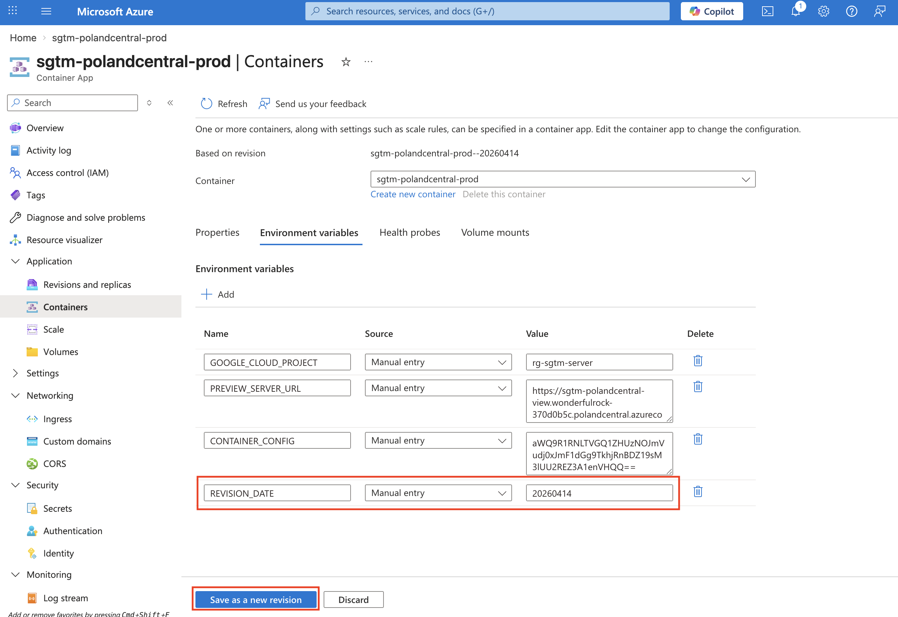

# Server-side Google Tag Manager on Azure Container Apps

Step-by-step scripts to deploy [server-side GTM](https://developers.google.com/tag-platform/tag-manager/server-side) on **Microsoft Azure Container Apps** and to attach a custom domain with a free managed SSL certificate.

## Scripts

| Script | Purpose |
|--------|---------|
| **`sgtm_deployment.sh`** | Deploy sGTM: preview and production Container Apps, Log Analytics workspace. |
| **`sgtm_custom_domain.sh`** | Map a custom domain to the production app using an **A record** and a **free managed SSL certificate**. |

Run both in **Azure Cloud Shell** (Bash): [shell.azure.com](https://shell.azure.com).

## Prerequisites

- Azure subscription
- **Container config string** from your server-side GTM container (in GTM: container settings)
- For custom domain: a domain and access to its DNS

## Quick start

1. **Deploy sGTM**  
   Open `sgtm_deployment.sh`, set `CONTAINER_CONFIG` in Step 2 to your config string, then run the steps in order.

2. **Custom domain (recommended)**  
   After deployment, open `sgtm_custom_domain.sh`, set `CUSTOM_DOMAIN`, then run the steps in order.

## Updating containers (new revision)

After initial deployment, you may need to deploy a new revision of your sGTM container (e.g. after sGTM docker image updates).

### Navigate to Container Apps

1. Go to **Azure Portal**
2. Open **Container Apps**
3. Select your **container app** 

## Options to deploy a new revision

#### Option 1: Create revision manually (recommended)

1. Go to **Revisions and replicas**
2. Click **Create new revision**
3. Enter a revision suffix (e.g. current date in format `YYYYMMDD`)
4. Click **Create**

This is the cleanest method and keeps revisions clearly versioned.

#### Option 2: Trigger revision via config change

1. Go to **Containers** or **Scale**
2. Either:
   - Add/update an environment variable (e.g. `REVISION_DATE`)
   - Or change the number of instances in Scale
3. Click **Save as new revision**

This method is useful for quick updates but less explicit for versioning.

## Screenshots

### Create revision manually

### Trigger revision via config change

## License

Use and adapt as needed.
